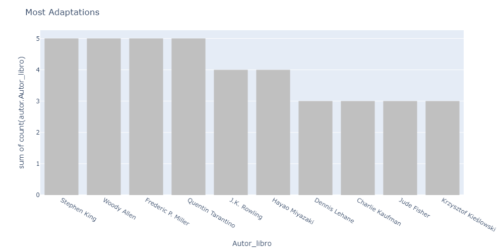
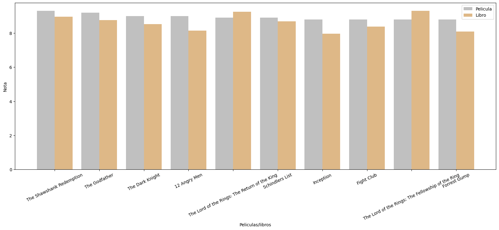
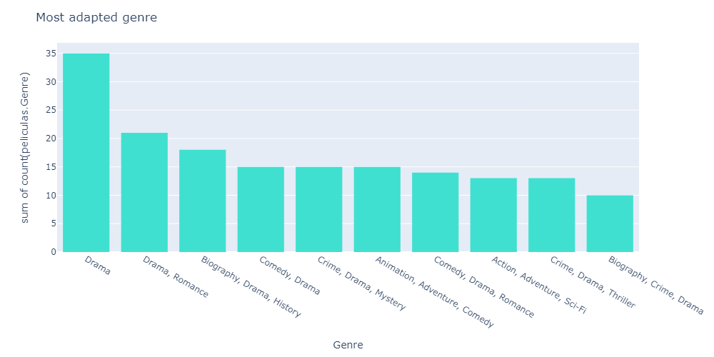
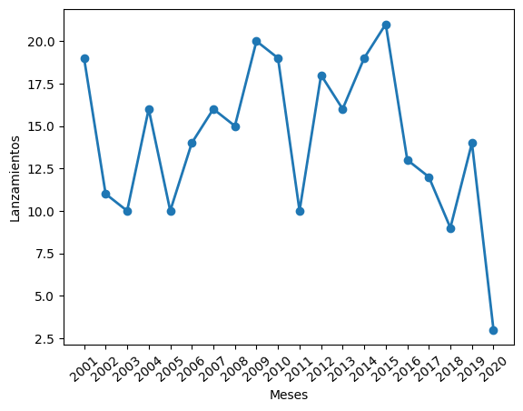
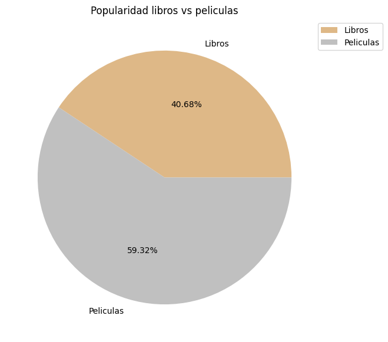
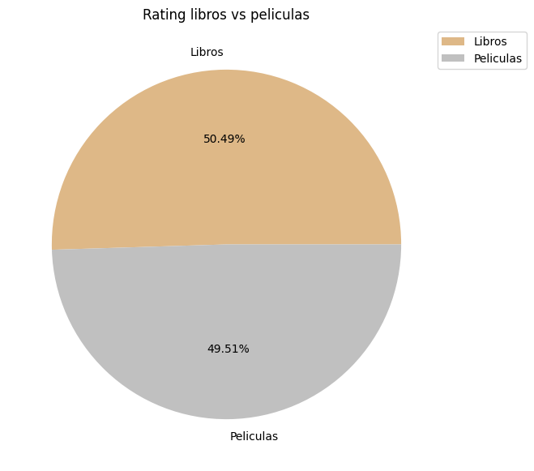

# Who are the Authors with most adaptations to the big screen?

    Here we see many well known authors but we see aswell a few famous movie directors, why does this happen? i came to a conclusion that some popular movies that don't come from any book actually write a book expanding the movie, and this is included in this graph.

# Which are the best rated movie adaptations?

---
    As we can see in this graph the best movie adaptations are even better that most of their book counterparts, the only exception being LOTR.

# What's the most popular book genre to get a movie adaptation?
---

    In this graph we see that Drama is by far the most popular genre, as it gets adaptations in many different categories, and the second most popular after all the Drama categories would be Animation/Adventure/Comedy. I fin this interesting as i thought it would maybie be action movies.
 
# How many movie adaptations do we see every year?
    I think it's interesting to see how many books see their adaptations over the years, so i took a 20 year sample to evaluate it.

    In this graph we can apreciate that there is between 10 and 20 movie adaptation releases every year and it fluctuates a lot.
    We won't take in consideration 2020 and forward as my base database was lacking that information.

# What's more popular? A book or a movie?
    To answer this question i extracted the average votes of every book scraped in goodreads and did the same thing to their counterpart movies, this way i can compare both averages and make my conclusion.

    As we can see in this pie chart it's easy to see that movies are quite more popular as they have a 60/40 positive average ratio compared to books. 

## Now i want to make maybie the most polemic question.
# What's better? a book or it's movie adaptation?

    I have allways been told that the original books are allways better, so i expected the graph to have a huge lead by books, but to my surprise the books are only about a 1% over their movie counterpart, so i would say it's even.

